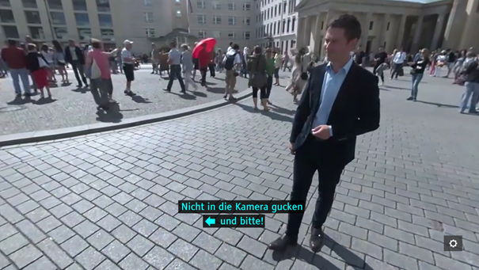
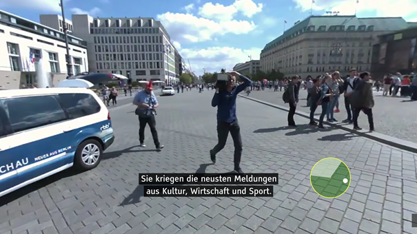

# 360° Video Subtitles Explainer
## Introduction
A lot of 360 video content is already offered. Most of the time the content is not accessible for certain user groups like the deaf and hard of hearing. One of the reasons is the lack of technical standards for 360 subtitles.

Using Web VR (now Web XR) the web platform is an interoperable layer between immersive content and display devices. The Timed Text working group of the W3C is home of important standards for subtitle and captions. Therefore, the goal is to find a solution for rendering and activating of subtitles using web technologies. It may be adopted in a different technical context.

The solution scope is narrowed down to subtitles for 360 video content and also to two specific subtitle features:
* The display of subtitles that are fixed to the screen and therefore always visible to the user.
* An indication to which "position" in the 360 video the subtitle relates to (e.g. the position of the speaker of the subtitles text).

One part of the solution is to persist the intent for 360 subtitle presentation in a suitable data format. 

Another part is to define the handover/the API between the web platform and the presentation device.  

## Goals
### Extension of the Timed Text Markup Language (TTML)
* Define syntax and semantics that indicate that a TTML document is authored for 360 video content 
* Define syntax and semantics that indicate TTML content should be always visible and “fixed to the screen” of the rendering device.
* Add vocabulary that indicate to which position in the 360 environment TTML content relates (e.g. the position of a speaker).

#### Reasoning
* To take advantage of existing subtitles formats and activities in W3C the proposal is to define an extension in the Timed Text Markup Language and to add this extension to the TTML profile IMSC. 
* Extensive user tests based on prototypical implementation give clear indications for the need to have a "fixed to screen solution" and a way to indicate the position of the speaker. The user tests have been executed by partners of the funded project [ImAc](www.imac-project.eu) (Immersive Accessibility).

### XR extension for the web platform
* Define handover responsibilities/API between web platform and display devices enabling the rendering and activation of 360 subtitles.

## Non-Goals
* Solution for [six degrees of freedom (6DoF)](https://en.wikipedia.org/wiki/Six_degrees_of_freedom) applications .
* Solutions for stereoscopic 360 video content are out of scope.
* Overall solution for Subtitles in XR.

#### Reasoning
The limitation on two features for 360 video keeps the solution complexity at a manageable level. XR technologies and devices are still constantly changing. It makes the solution context a moving target. Often it is not clear at which point of the overall technical platform a solution needs to be applied. 

## Key Scenarios
The "speaker" is not visible in the current field of view. The user needs to know where to navigate so he can see the speaker.

### Arrow indicator
An arrow is placed left or right next to the subtitle. The arrow is shown when the speaker is not visible within the picture. It is pointing into the direction of the speaker. The arrow disappears as soon as the speaker becomes visible.

The below picture shows an example. A reporter is in the current field of view but the subtitle is related to the instructions of the director (who is not visible in the picture). An arrow at the second line of the subtitle points to the direction of the speaker (in the case the director). The subtitle text is "Nicht in die Kamera gucken und bitte". This translates into "Do not look into the camera and action!"

### Radar indicator
A "radar system" is rendered next to the subtitle and is always active. It indicates the current viewing direction. For each active subtitle, a colored dot is rendered into the radar system. It points to the horizontal position of the related speaker within the 360° scene.

The below picture shows an example. Two crew members of the film team are shown, but the subtitle relates to the reporter who is not shown in the picture. A circle in the picture simulates a "radar". A white dot in the "radar circle" indicates that the reporter is right of the field of view.

## Design Discussions

### Positioning of a subtitle region within a 360° scene
We understand the 360° scene as a 3D space with the following constraints:

* The 3D space’s purpose is to render an image for the presentation on a screen. 
  * The image is rendered as a virtual camera would capture it. 
  * A "screen" may belong to a tablet, a PC screen or to a head-mounted display.
* The 3D space contains a non-stereoscopic video mapped onto a geometrical shape. Typically, the geometrical shape is a sphere or a cube.

We suggest spanning a 2D coordinate system in the 360° scene. It used for the subtitle rendering plane. The subtitle rendering plane is the root container region of an IMSC document. The positioning of the subtitle within the root container region shall follow the IMSC specification where possible.

When rendering onto a 2D screen the IMSC subtitle plane (i.e. the root container region) should be mapped to the field of view. It spans over the entire viewport.

A different solution may be needed for HMDs. In HMDs, the resolution is typically a lot lower, the aspect ratio is different, and the image is often not sharp until the edges of the picture. Additionally, the HMD doesn’t show a clear, rectangular viewport. Thus, some of the style attributes for subtitles would probably be authored differently, if the file is intended for an HMD.

It needs to be investigated if additional attributes need to be defined for presentation within an HMD.

## Considered alternatives
The current draft of MPEG OMAF has been reviewed. It defines a feature to position a 2D plane always in front of the viewer. But the current draft does not contain a feature to indicate the position of the speaker in a 360 scene. An option would be to add the missing feature to MPEG OMAF. But then the solution may be limited to applications that support OMAF. A more interoperable solution would be a solution for the web platform.  

### Sample implementations
The funded project ImAc implemented an accessible player for 360 video content. It implements the features suggested in this proposal. It can be trialed on PC or HDM environments at https://imac.gpac-licensing.com/player/.

### Related issues & discussions
* Issues in the proposal repository of the Immersive Web Community Group
  * [Requirements for subtitles and text in WebXR](https://github.com/immersive-web/proposals/issues/40)
  * [Use case descriptions for subtitles in 360°](https://github.com/immersive-web/proposals/issues/39)
* Standard requests Timed Text Working Group
  * [Support 3D space (360°/VR/XR) as target presentation environment](https://github.com/w3c/tt-reqs/issues/8)
* Discussions 
  * [Minutes from the immersive web community call](https://www.w3.org/2019/05/21-immersive-web-minutes.html)  

### References 
* [MPEG OMAF](https://mpeg.chiariglione.org/standards/mpeg-i/omnidirectional-media-format)
* [Timed Text Markup Language 2 (TTML2)](https://www.w3.org/TR/ttml2/)
* [TTML Profiles for Internet Media Subtitles and Captions 1.1 (IMSC 1.1)](https://www.w3.org/TR/ttml-imsc1.1/)
* [WebXR Device API](https://immersive-web.github.io/webxr/)

### Acknowledgements
* Authors: [@peterthopesch](https://github.com/peterthopesch), [@tairt](https://github.com/tairt)
* Thank’s for support to partners of the ImAc project (www.imac-project.eu)
* Mario Montagaud, i2cat
